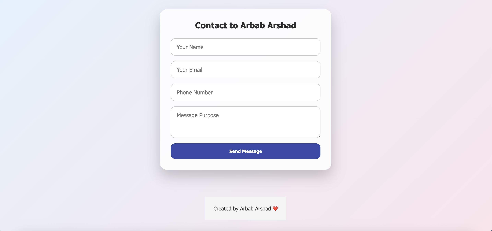

# 📬 Contact Form - React JS + EmailJS

A sleek and professional **Contact Form** built with **React JS** and **EmailJS** to send messages directly to your email — without needing a backend. It features smooth animations, responsive design, toast notifications, and a clean modern UI.

---

## 🖼️ Preview



---

## 🔗 Live Demo

[]()


---

## 🚀 Features

- Collects user **Name**, **Email**, **Phone Number**, and **Message Purpose**
- Sends form data directly to your email via **EmailJS**
- Fully **responsive** layout (Mobile / Tablet / Laptop)
- **Framer Motion animations** throughout the app
- **Toast notifications** for success/error feedback
- **Loading spinner** while sending messages
- **Animated footer** with developer credits
- Clean **light-themed** design with hover and shadow effects

---

## 🛠️ Tech Stack

- React JS (with Vite)
- EmailJS (no backend)
- Framer Motion (for animations)
- React Icons (optional)
- Toastify for alerts
- Pure CSS with media queries

---

## 🔧 Project Setup

```bash
# Create Vite React project
npm create vite@latest contact-form --template react
cd contact-form

# Install required packages
npm install
npm install emailjs-com framer-motion react-icons react-toastify

# Start development server
npm run dev
```

contact-form/
├── public/
│   └── screenshot.png         # App preview image
├── src/
│   ├── components/
│   │   ├── ContactForm.jsx
│   │   ├── Footer.jsx
│   │   ├── Spinner.jsx
│   │   └── respective CSS files
│   ├── App.jsx
│   ├── App.css
│   ├── main.jsx
│   ├── index.css
├── .gitignore
├── package.json
├── README.md
└── vite.config.js